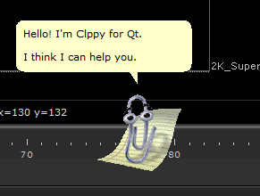

# ClippyQt
<b>Overview</b>



Clippy for PySide2. 
This provides a generic Clippy Widget, with animations, that can be used in any PySide2 application.

The project was inspired by and originally forked from <a href="https://github.com/LoganKelly/ClippyForMaya">ClippyForMaya</a> 
by Ryan Bland, Logan Kelly, and Nick Hurm, although None of the original code remains, and it was rewritten 
loosely based on <a href="https://github.com/clippyjs/clippy.js">ClippyJS</a>. 


The code is provided as is, and has not been rigorously tested in a production environment.

<b>Usage</b>

```python
from clippy_qt.engine import ClippyEngine


if __name__ == '__main__':

    engine = ClippyEngine()

    # You need to make your own widget to display in the balloon
    bubble_layout = QtWidgets.QVBoxLayout(engine.balloon)
    bubble_layout.addWidget(QtWidgets.QLabel('Hello, World!'))
    bubble_layout.addWidget(QtWidgets.QCheckBox('Check me!'))
    bubble_layout.addWidget(QtWidgets.QTextEdit('Edit Me!'))
    bubble_layout.addWidget(QtWidgets.QPushButton('Close'))
    bubble_widget = QtWidgets.QWidget()
    bubble_widget.setLayout(bubble_layout)
    
    engine.set_widget(bubble_widget)

    engine.show()
```
